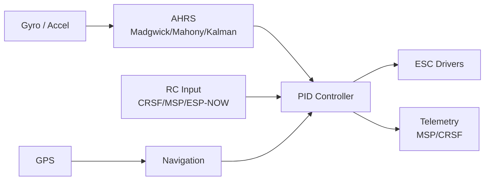

  

    

  <b>Multi-platform ESP32 / RP2040 flight controller firmware</b>

---

## 🛸 Overview

A multi-platform flight controller supporting ESP32, ESP8266, and RP2040, with Betaflight-compatible libraries, MSP and CRSF protocols, advanced AHRS fusion, and GPS navigation.

---

## 🛠️ Features

- **Targets:** ESP32, ESP8266, RP2040
- **AHRS:** Madgwick, Mahony, Kalman filter
- **Protocols:** MSP, CRSF, ESP-NOW
- **Hardware:** Multiple ESC drivers, GPS, barometer, compass

---

## 🚀 Tech Stack

    

---

  

